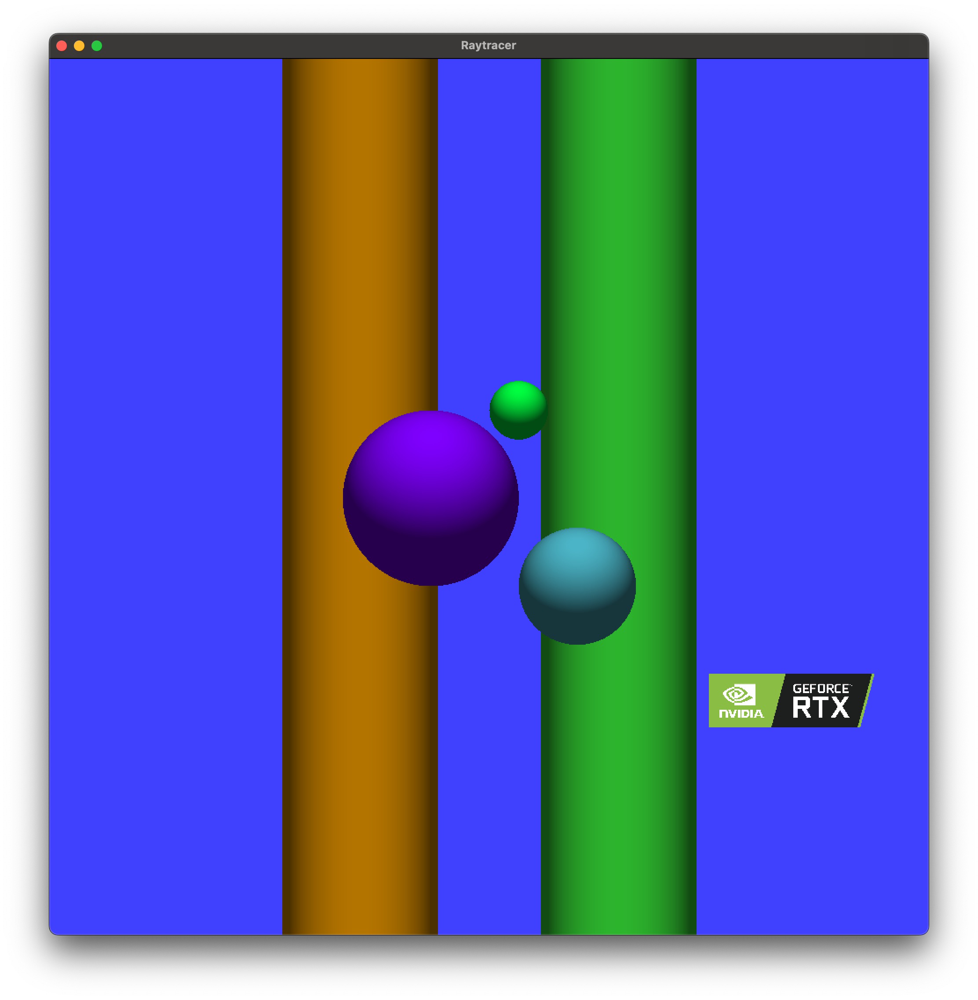
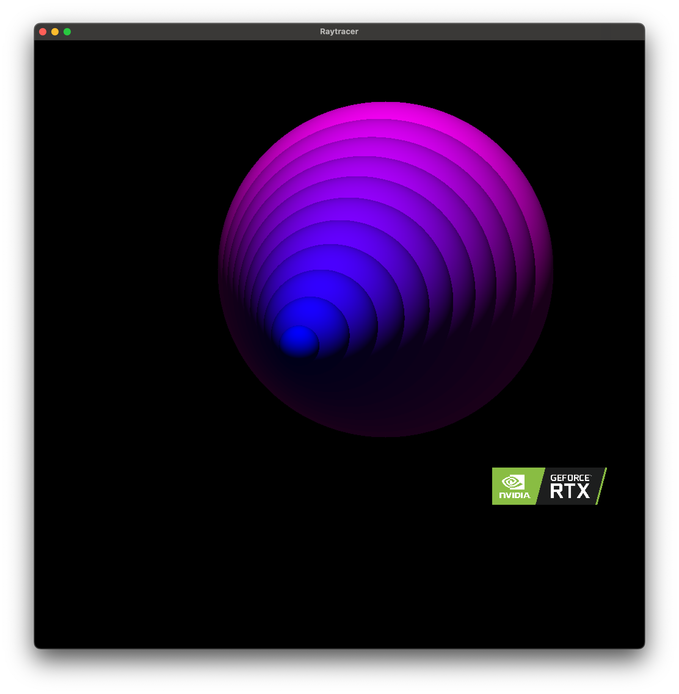
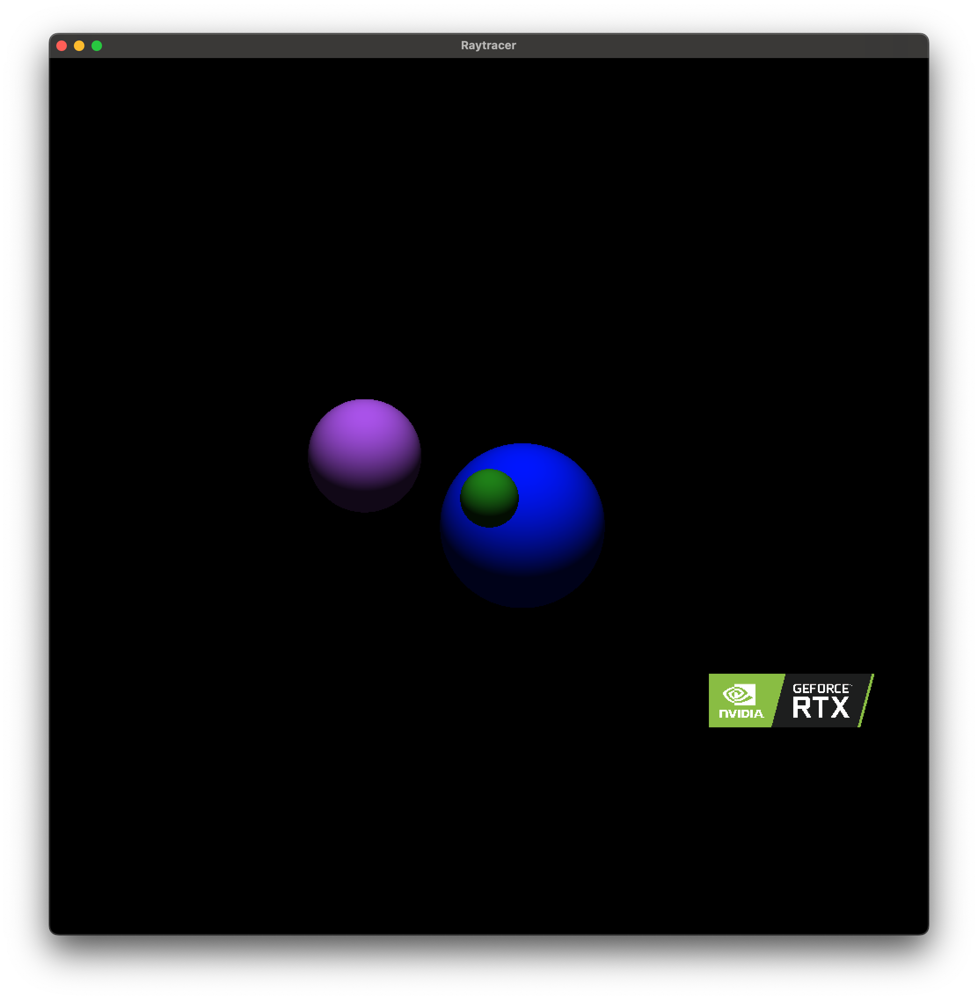

# Raytracer

A CPU-based raytracer implementation that renders 3D scenes defined in configuration files.





## Description

This raytracer supports:
- Spheres, planes, cylinders and rectangles primitives
- Point lights and ambient lighting
- Camera positioning and field of view
- Real-time rendering with SFML
- Scene configuration through .cfg files
- Interactive camera movement (ZQSD keys)

## Requirements

- C++ compiler with C++20 support
- SFML library
- libconfig++

## Building

```bash
make
```

## Usage

```bash
./raytracer <scene_file>
```

### Example:

```bash
./raytracer scenes/example.cfg
```

## Scene Configuration

### Scenes are defined in .cfg files using libconfig format. Example scene structure:

```cfg
camera: {
    resolution = { width = 1000; height = 1000; };
    position = { x = 0.0; y = 0.0; z = -1000.0; };
    rotation = { x = 0; y = 0; z = 0; };
    fieldOfView = 72.0;
};

primitives: {
    spheres = ( ... );
    planes = ( ... );
    cylinders = ( ... );
    rectangles = ( ... );
};

lights: {
    ambient = 0.3;
    diffuse = 0.6;
    point = ( ... );
    directional = ( ... );
};
```

## Controls

Z: Move camera forward (+Z)
S: Move camera backward (-Z)
Q: Move camera left (+X)
D: Move camera right (-X)

## Features

Real-time rendering with SFML window
Multiple primitive types support
Configurable lighting and materials
Interactive camera controls
PPM output format support

## License

This project was developed at Epitech Technology.
